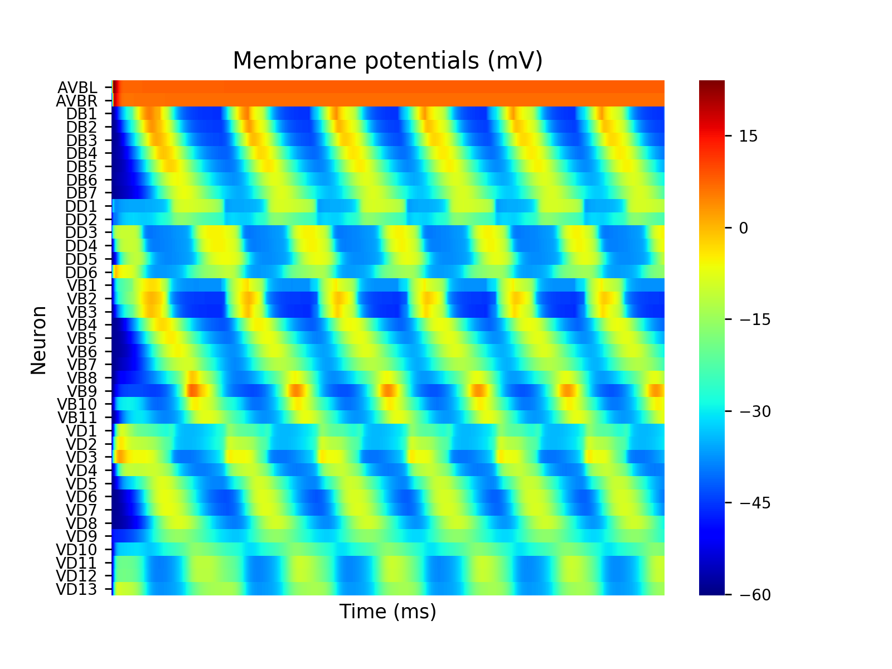

ODYNN : Optimization for DYnamic Neural Networks
===============================================================

.. image:: https://travis-ci.com/MarcusJP/ODYNN.svg?branch=master
    :target: https://travis-ci.com/MarcusJP/ODYNN
.. image:: https://codecov.io/gh/MarcusJP/ODYNN/branch/master/graph/badge.svg
    :target: https://codecov.io/gh/MarcusJP/ODYNN
.. image:: https://readthedocs.org/projects/odynn/badge/?version=latest
    :target: https://odynn.readthedocs.io/en/latest/?badge=latest
    :alt: Documentation Status

ODYNN is a python package aiming at providing an optimization suite for biological neural circuits.
It allows implementation of different neuron models, definition of circuit architectures, simulation and optimization of such circuits, and evaluation of the results.
Documentation and examples can be found at https://odynn.readthedocs.io

.. image:: img/final_goal.png
    :width: 800px
    :align: center
    :height: 500px
    :scale: 50
    :alt: Objective

Structure
-----------------

Getting started
---------------

You need python 3.5 or higher !

Run in the root directory :

1) install the required libraries

        make init

2) install the package

        python3 setup.py install

2) Launch tests

        make test

Folders
---------------

- docs : files for creating documentation with Sphinx
- img : images
- odynn : package python files
- tests : unit tests
- tutorial : notebook to run with Jupyter

Warnings
----------------

ODYNN is still in development and its syntax might change.

TODO
---------------

- more tutorials
