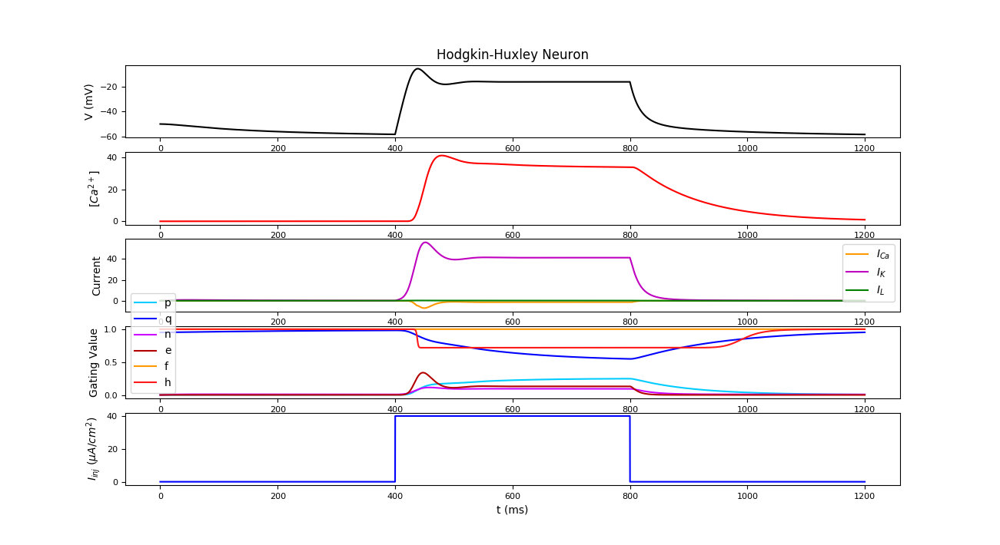

Installing the code
-------------------

Clone a local copy of this repository from Gitlab using::

      git clone https://gitlab.com/RastaMarcus/opt_HH

Go to the root directory and run::

      make init
      make install

Some examples
------------------

- Simulation :

.. code-block:: python

    from opthh.neuronsimul import NeuronSimul
    import scipy as sp
    t = sp.arange(0., 1200., 0.1)
    i = 20. * ((t>400) & (t<800))
    simul = NeuronSimul(t=t, i_inj=i)
    simul.simul(show=True)

